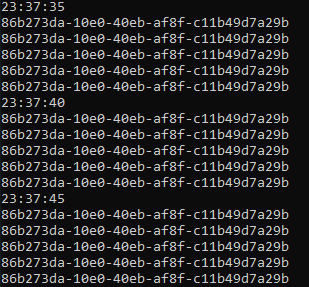

# Events

## Simple Events

This example is to showcase what events actually are.  
  
The `EventsSimple` project uses events, namely events that are invoked from when a button is pressed on the keyboard, and a subscriber then prints out a message on the console containing the key that was pressed.

> In `Program.cs` we subscribe to the *ButtonPressed* event:
>
> ```cs
> buttonMain.ButtonPressed += (sender, eventArgs) =>
> {
>     Console.WriteLine($"{eventArgs.Key.ToString().ToUpper()} was pressed.");
> };
> ```

We call a method, *OnButtonPressed*, in `Program.cs` that then invokes an event *ButtonPressed*:

> ```cs
>public event EventHandler<ButtonPressedEventArgs>? ButtonPressed;
>
> public void OnButtonPressed(char key)
> {
>    ButtonPressed?.Invoke(this, new ButtonPressedEventArgs(key));
> }
> ```

The *ButtonPressed* event is of type *ButtonPressedEventArgs* that stores the value of the key that was pressed:

> ```cs
> public class ButtonPressedEventArgs
> {
>     public ButtonPressedEventArgs(char key)
>     {
>         Key = key;
>     }
>
>     public char Key { get; }
> }
> ```

## Background Service Events

In the `EventsBackgroundService` project we use a background service in a WebAPI to trigger an event for the current time.  

For simplicity, we subscribe to these events in the *TickerService* as well which then prints out the current time in the console.  

We have multiple subscribers:
- OnEveryOneSecond
- OnEveryFiveSecond

### A Problem

If we wanted to print a different GUID every second instead of the time, we would create a new class `TransientService`:

```cs
> public class TransientService
> {
>     public Guid guid { get; } = Guid.NewGuid();
> }
```

We then can register this as a transient service in `Program`:

```cs
> builder.Services.AddTransient<TransientService>();
```

Finally, we can inject this new service into the `TickerService` and replace the Console message with the data from the new service:

```cs
> public event EventHandler<TickerEventArgs>? Ticked;
> private readonly TransientService _transientService;
> 
> public TickerService(TransientService transientService)
> {
>     _transientService = transientService;
>     Ticked += OnEveryOneSecond;
>     Ticked += OnEveryFiveSecond;
> }
> 
> public void OnEveryOneSecond(object? sender, TickerEventAr>args)
> {
>     Console.WriteLine(_transientService.guid);
> }
```

We expect that a new GUID will be generated every time, as it is a transient service which means a new instance should be provided to the service and hence a new GUID.  

This is not what happens:

 

We have a transient service *TransientService* within a singleton *TickerService* which means that the transient service would be resolved every time.  

Even if we change the *TickerService* to a transient service, we would get the same behaviour.

### The Solution

We could pass the *TransientService* all the way down to *TickerEventArgs*, but then we would get dependency nightmare.  

We can use `MediatR` to resolve this and would make things a lot more manageable.

## MediatR

There are two types MediatR messages:
- Request/response messages that is dispatched to a *single handler*.
- Notification messages that is dispatched to *multiple handlers*.

Here we will use the notification-based MediatR.

## References

Chapsas, N. [Nick Chapsas]. (2022, March 17). *Are events in C# even relevant anymore?* [Video]. YouTube. https://www.youtube.com/watch?v=NmmpXcMxCjY&ab_channel=NickChapsas
